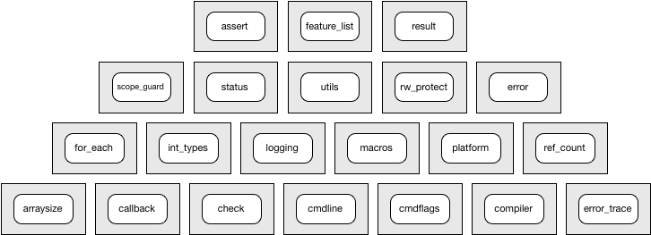
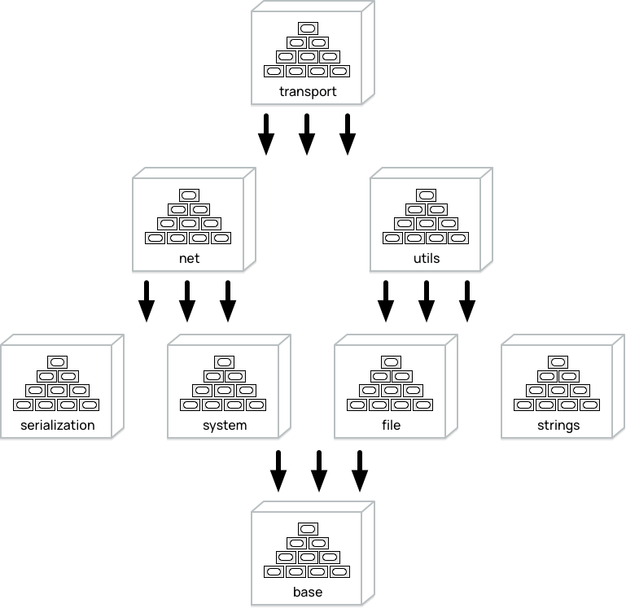

# KWCToolkit
KWCToolkit provides a small set of libraries and tools for Windows/Unix system programming.
The entire toolkit is fully self-contained and does not require any external dependencies
other than a C++ compiler and a standard C++ runtime.

## Design rationale
The idea behind KWCToolkit is to use this code as a drop-in placement for a given project
at hand. In other words this code is meant to be copy-pasted into a given project at hand,
modifying inclusion guards, namespaces and such things using the scripts provided in this
repository, starting to work on the actual project quickly.

This approach is in stark contrast to the usual practice of building a library together
with public includes and linking it to the _other_ project for different reasons:
For one, the code in this repository is meant to be adjusted and adapted to whatever the
target application or system looks like. Maybe it requires certain status code to be set
and sent to another part of the system, maybe there is some implementation already for
specific tasks (e.g I/O) or even certain sub-modules of this codebase (say strings/ or
system/) are not required at all and hence need to get deleted completely.

While this is probably doable using the usual library approach in a most generic way, the
design rationale here is to go a more basic route of simply copying everything that is
needed in place as outlined before. Furthermore, everything that gets implemented here
should also serve as a best-practice in terms of software design and build systems as
for whatever the current year and state-of-the-art is currently.

## Architecture
The phyiscal structure of this repository consists of several folders. Each folder defines a
module. Each module consists of several header/source implementations called a component.
All component are supposed to be finely graduated granular solutions for a specific problem.
For instance for the base module the logical structure looks as follows:

It is allowed that components in the _same_ module depend on one another but should not depend
on other modules (at least in the case of the base module).

### Modules
The design rationale is that modules  are composable and can be stacked on one another in a
hierarchical manner. Higher level modules  can depend on lower level modules but not the other
way around:

Each module on a physical level is a distinct releasable unit (e.g. shared library).
